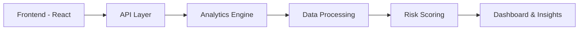

# 🚀 RiskLens Advanced

### AI-Powered Risk Intelligence & Decision Analytics Platform

<p align="center">
  <b>From Raw Data → Risk Insights → Executive Decisions</b>
</p>

<p align="center">
  <a href="https://superb-puffpuff-f16f70.netlify.app/"><b>🌐 Live Demo</b></a> •
  <a href="https://github.com/Madhur0203/risklens-advanced"><b>📦 Repository</b></a>
</p>

---

## 🧠 What is RiskLens?

**RiskLens Advanced** is a full-stack analytics platform that simulates real-world risk intelligence systems used in finance and enterprise environments.

It ingests large datasets, evaluates risk using analytical models, and delivers **interactive dashboards + case-level intelligence + decision support insights**.

> Designed to demonstrate how modern data systems transform **data into decisions**.

---

## ✨ Core Highlights

✔️ 1200+ dynamically generated risk cases
✔️ Real-time KPI dashboards
✔️ Risk classification (High / Medium / Low)
✔️ Executive-level insights & analytics
✔️ Full-stack architecture (Frontend + Backend + Analytics Engine)
✔️ One-click demo dataset generation
✔️ Production-style scalable design

---

## 📊 Product Preview

### 🖥️ Dashboard Experience

* KPI Cards (Total Cases, Risk Levels, Avg Risk Score)
* Category & Region distribution
* Time-series trends
* Clean executive UI

### 📁 Case Intelligence

* 1000+ case records
* Risk scoring engine
* Detailed case-level insights
* Pagination-ready architecture

---

## 🏗️ System Architecture



---

## ⚙️ Tech Stack

### 🖥️ Frontend

* React + TypeScript
* Vite
* Tailwind CSS
* ShadCN UI

### ⚙️ Backend

* FastAPI / Node.js
* REST API architecture

### 📊 Analytics Layer

* Python
* Pandas, NumPy
* KPI computation & aggregation

### ☁️ Deployment

* Netlify (Frontend)
* Render (Backend)

---

## 🚀 Live Demo

👉 [https://risklens-advanced.netlify.app/](https://superb-puffpuff-f16f70.netlify.app/)

> Click **"Generate Demo Data"** to simulate 1200+ real-world cases.

---

## 🧪 Demo Flow (Recruiter-Friendly)

1. Open the app
2. Generate demo dataset
3. Explore dashboard KPIs
4. Analyze risk distribution
5. Drill into case-level insights

---

## 📈 Example Insights

* High-risk case identification
* Category-based risk distribution
* Region-wise risk exposure
* Trend analysis over time
* KPI-driven decision support

---

## 🧩 Project Structure

```bash
RiskLensAdvanced/
│
├── frontend/        # React + UI
├── backend/         # API + analytics
├── data/            # Synthetic datasets
├── netlify.toml     # Deployment config
└── README.md
```

---

## ⚡ Getting Started

### Clone Repo

```bash
git clone https://github.com/Madhur0203/risklens-advanced.git
cd risklens-advanced
```

### Backend Setup

```bash
cd backend
pip install -r requirements.txt
uvicorn app.main:app --reload
```

### Frontend Setup

```bash
cd frontend
npm install
npm run dev
```

---

## 🧠 Engineering Depth

This project demonstrates:

* End-to-end data pipeline design
* Data modeling & KPI computation
* Scalable frontend architecture
* API integration & state management
* Analytical thinking for business problems
* Clean separation of concerns

---

## 🎯 Real-World Use Cases

* Financial Risk Analytics
* Fraud Detection Systems
* Compliance Monitoring
* Business Intelligence Platforms
* Decision Support Systems

---

## 🏆 Why This Stands Out

Unlike basic dashboard projects:

* ✅ Uses **large-scale dataset (1200+ records)**
* ✅ Includes **analytics + decision layer**
* ✅ Simulates **real enterprise workflow**
* ✅ Built with **production mindset**
* ✅ Designed for **recruiter impact**

---

## 📸 Screenshots

> Add:

* Dashboard view
* Case table
* Risk distribution charts

---

## 📌 Resume-Ready Impact

* Built a full-stack risk analytics platform processing **1200+ records**
* Designed KPI dashboards for **executive-level decision support**
* Developed analytical pipeline for **risk classification & insights**
* Implemented scalable architecture integrating UI, API, and analytics

---

## 👨‍💻 Author

**Madhur Gattani**
Data Analyst | AI & Analytics Enthusiast

* GitHub: [https://github.com/Madhur0203](https://github.com/Madhur0203)
* LinkedIn: *(add link)*

---

## ⭐ Support

If you like this project:

⭐ Star the repo
🍴 Fork it
🤝 Connect with me
